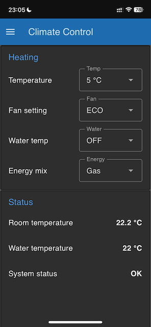

# inetbox2mqtt on Venus OS

## Introduction

This is a fork of the original inetbox2mqtt Truma iNet Box emulator found under https://github.com/mc0110/inetbox2mqtt for the purpose of for porting it to standard CPython.

The original inetbox2mqtt has been implemented in MicroPython and is meant to run on a dedicated microcontroller board such as an ESP32. Since some of the RV installations already run the Victron Cerbo GX Venus OS on a standard Raspberry Pi, it would be good to use the same for executing the intebox2mqtt.

The approach consists of porting inetbox2mqtt from MicroPython to the standard CPython for running it on the Raspberry Pi. The Web OS is no longer needed, since the configuration file `etc/inetbox2mqtt` can be directly edited by connecting the RPi via SSH. Whereas the encrypted configuration generated by the Web OS has been replaced by a plain text config file.

Since the Venus OS manages its own network connectivity, all network configuration code has been removed from `connect.py`.

The status LED functionality used for LIN bus debugging has also been disabled, since the user can directly access the log files to achieve the same.

Additionally, a Node-Red dashboard for controlling the Truma Combi heater has been implemented under `node-red/caravan-dashboard.json`.

## Prerequisites

The setup has been tested on a Raspberry Pi 3 running the Victron Venus OS Large version. This guide assumes that you have a working Venus OS installation and you are familiar with the Victron Cerbo GX / Venus OS basic concepts.

For general Venus OS Large installation instructions, please visit https://www.victronenergy.com/live/venus-os:large.


## Installation

Following are the installation instructions:

1. Clone this repository under `/opt/inetbox2mqtt`

2. Create symbolic links for the configuration and init.d startup scripts:

   * `ln -s /opt/inetbox2mqtt/etc/inetbox2mqtt /etc/inetbox2mqtt`

   * `ln -s /opt/inetbox2mqtt/etc/init.d/inetbox2mqtt /etc/init.d/inetbox2mqtt`

3. Enable service auto start:
   * `ln -s /etc/init.d/inetbox2mqtt /etc/rc5.d/S99inetbox2mqtt`

4. Edit the configuration parameters in `/etc/inetbox2mqtt`
   * Since we are going to connect to the local MQTT server provided by Venus OS, the MQTT server and port can be left unchanged at `localhost` and `1883`.
   * Since we are using an external FTDI compatible USB to serial converter, the serial device needs to be set to something like `/dev/serial/by-id/usb-FTDI_FT232R_USB_UART_00000000-if00-port0` (please change to your serial device identifier).

## Venus OS Configuration

Before starting the inetbox2mqtt service, the following Venus OS adaptations need to be done.

First of all, you need to enable MQTT access via the Venus GUI under "Settings > Services"

Then you need to enable Node-Red under "Settings > Venus OS Large features". Node-Red will provide the web interface for controlling your Truma device.

Finally, you need to configure a rule to prevent Venus OS from automatically grabbing the serial port in use by the USB to serial adapter. In order to achieve this, please add the following line to `/etc/udev/rules.d/serial-starter.rules`:

`ACTION=="add", ENV{ID_BUS}=="usb", ENV{ID_MODEL}=="FT232R_USB_UART", ENV{VE_SERVICE}="ignore"`

Where the exact value for ID_MODEL can be retrieved by executing the following command:

`udevadm info /dev/serial/by-id/usb-FTDI_FT232R_USB_UART_00000000-if00-port0`

Whereas the device name needs to replaced with the one corresponding to the USB to serial converter in use.

Also, comment out any other line that refers to your serial device ID_MODEL.

## Installing the Node-Red Dashboard

Having activated Node-Red, you may want to install the dashboard for controlling the Truma Combi.

First you have to login to your Node-Red editor under `<ip_address>:1881`, where ip_address needs to be replaced with your Raspberry Pi local IP address.

Then click on the "hamburger menu" at the top right corner and select the "Manage Palette" menu item. There you need to find and install the "node-red-dashboard" addon.

Afterwards please select the "Import" menu item in order to import the `node-red/caravan-dashboard.json` file. The Truma Combi dashboard will be displayed under the "Climate Control" tab. Please feel free to disable any addtional tabs that are not applicable to your setup.



## Hardware Setup

Coming soon...


## Bringup

Once the required hardware connections have been made, your are going to need to pair the Truma CP Plus control panel with the newly installed setup.

First please disconnect any existing iNet Box and got to the "RESET > PR SET" menu of your CP Plus to initialize it without the iNet Box. Then go to the "INDEX" menu to verify that the following two entries are present:

* TRUMA: Hx.00.nn
* CPplus: Cy.0z.00

Now you need to start the inetbox2mqtt service by calling

`/etc/init.d/inetbox2mqtt start`

Then please connect the LIN bus cable to the inetbox2mqtt setup and repet the initialization procedure. Afterwards you should see the following three items in the "INDEX" menu of the CP Plus:

* TRUMA: Hx.00.nn
* CPplus: Cy.0z.00
* inetbox: T23.70.0

If everything goes well, you should be able to see the following log output in `/var/log/inetbox2mqtt`:

```
2025-04-29 20:57:30,833 [connect] INFO: Detected cpython 3.8.18.final.0 on port: linux
2025-04-29 20:57:30,840 [connect] INFO: MQTT Port is switched to port: 1883
2025-04-29 20:57:30,841 [__main__] INFO: HW-Check RPi linux
2025-04-29 20:57:30,847 [__main__] INFO: prefix: 'truma' set: 'service/truma/set/' status: 'service/truma/control_status/'
2025-04-29 20:57:31,852 [__main__] INFO: lin-loop is running
2025-04-29 20:57:50,879 [mqtt_async2] INFO: Connecting to ('::1', 1883, 0, 0) id=b'b827ebd304b1' clean=1
2025-04-29 20:57:50,907 [mqtt_async2] INFO: Connecting to ('::1', 1883, 0, 0) id=b'b827ebd304b1' clean=0
2025-04-29 20:57:50,949 [connect] INFO: MQTT connected
```

Now you can access the Node-Red dashboard under `<ip_address>:1881/ui`. The dashboard must show the current Truma Combi settings as well as the room and water temperature values. Further you must be able to see "ON" in the "Connection status" field.

The Node-Red dashboard can also be accessed remotely via the Victron VRM portal under the "Venus OS Large" menu item.

