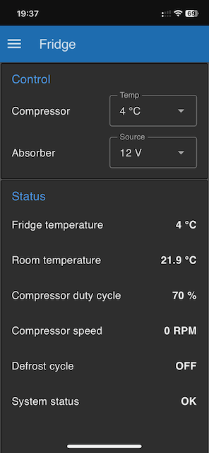
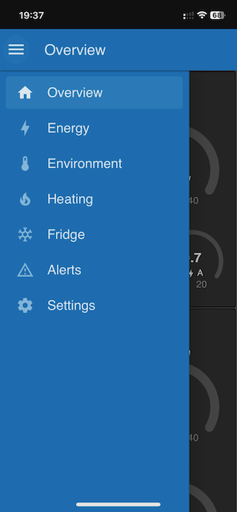
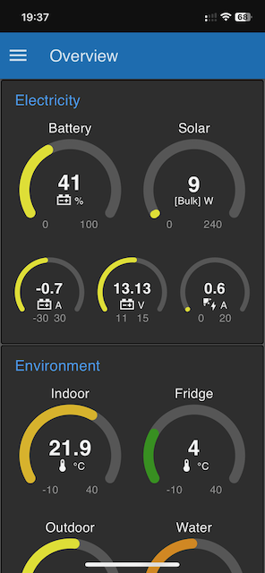
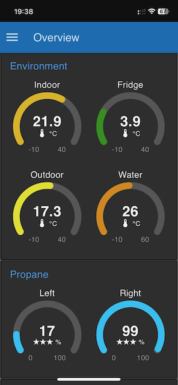
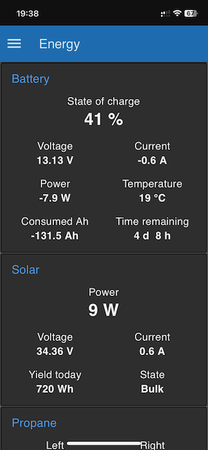
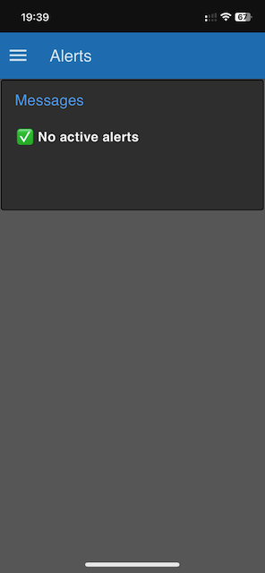

# inetbox2mqtt on Venus OS

## Introduction

This is a fork of the original inetbox2mqtt Truma iNet Box emulator found at [https://github.com/mc0110/inetbox2mqtt](https://github.com/mc0110/inetbox2mqtt), created for the purpose of porting it to standard CPython.

The original inetbox2mqtt was implemented in MicroPython and is intended to run on a dedicated microcontroller board such as an ESP32. Since some RV installations already run Victron Cerbo GX with Venus OS on a standard Raspberry Pi, it is beneficial to use the same platform to run inetbox2mqtt.

This fork ports inetbox2mqtt from MicroPython to standard CPython for execution on a Raspberry Pi. The Web OS is no longer required, as the configuration file (`etc/inetbox2mqtt`) can now be edited directly via SSH. The encrypted configuration previously generated by the Web OS has been replaced with a plain-text configuration file.

Since Venus OS manages its own network connectivity, all network configuration code has been removed from `connect.py`.

The status LED functionality previously used for LIN bus debugging has also been disabled, as users can now access the log files directly.

Additionally, a Node-RED dashboard for controlling the Truma Combi heater is included under `node-red/caravan-dashboard.json`.

## Prerequisites

This setup has been tested on a Raspberry Pi 3 running the Victron Venus OS Large version with Node-RED enabled. This guide assumes you have a working Venus OS installation and are familiar with Victron Cerbo GX, Venus OS, and Node-RED concepts.

It also assumes you have configured SSH root access to Venus OS.

For general Venus OS Large and Node-RED setup instructions, visit [https://www.victronenergy.com/live/venus-os:large](https://www.victronenergy.com/live/venus-os:large).

## Hardware Setup

This setup uses a TJA1020 TTL UART to LIN bus converter. To simplify wiring and avoid interfering with Venus OS operations, the onboard serial port of the Raspberry Pi is not used. Instead, an FT232RL-compatible USB-to-serial converter is recommended. The voltage jumper on the FT232RL board should be set to 3.3V to ensure compatibility with the TJA1020 module.

The electrical connections are described in the following table:

| FT232RL Pin | TJA1020 Pin | LIN Bus | Power Supply     |
|-------------|-------------|---------|------------------|
| GND         | GND         | GND     |                  |
| RXD         | TX          |         |                  |
| TXD         | RX          |         |                  |
|             | LIN         | LIN     |                  |
|             | 12V         |         | +12V fused 100mA |


The images below display the completed setup, where the TJA1020 and FT232RL modules are connected together on a prototyping stripboard:


The following image shows the LIN bus RJ12 connector pinout:


The RJ12 connecter can be plugged into any free LIN port on the CP Plus or Truma Combi.

Further details are provided in the [original inetbox2mqtt electrics guide](doc/ELECTRIC.md) and [this similar project](https://github.com/danielfett/inetbox.py).

## Installation

Follow these steps for installation:

1. Clone this repository to `/opt/inetbox2mqtt`.

2. Create symbolic link for the service startup script:

    ```bash
    ln -s /opt/inetbox2mqtt/service/inetbox2mqtt /opt/victronenergy/service/
    ```

3. Create symbolic link for the temperature reporting script -
   enables displaying the room and water temperatures in the Victron GUI V2 as well as VRM portal:

    ```bash
    ln -s /opt/inetbox2mqtt/service/RpiTemperature /opt/victronenergy/service/
    ```

4. Edit the configuration parameters in `/etc/inetbox2mqtt`:
    - Use `localhost` and port `1883` for connecting to the local MQTT server provided by Venus OS.
    - Set the serial device path to your FTDI-compatible adapter, e.g.:
      `/dev/serial/by-id/usb-FTDI_FT232R_USB_UART_00000000-if00-port0`

5. Additional services—such as **bt-daemon** (for enabling RFCOMM Bluetooth devices) and **gpio-daemon** (for allowing GPIO control by non‑root users)—are available at https://github.com/microfarad-de/nastia-server/tree/venus-os.
   These scripts are required for the fridge controller Node‑RED flow described at https://github.com/microfarad-de/fridge-controller.


## Venus OS Configuration

Before starting the inetbox2mqtt service, configure the following in Venus OS:

1. Enable MQTT access via the Venus GUI at `http://<rpi_ip_address>` under **Settings > Services**.

2. Enable Node-RED under **Settings > Venus OS Large features**. This will provide the web interface to control your Truma Combi.

3. Prevent Venus OS from automatically using the serial port by adding the following line to `/etc/udev/rules.d/serial-starter.rules`:

    ```text
    ACTION=="add", ENV{ID_BUS}=="usb", ENV{ID_MODEL}=="FT232R_USB_UART", ENV{VE_SERVICE}="ignore"
    ```

    Retrieve the correct `ID_MODEL` value by running:

    ```bash
    udevadm info /dev/serial/by-id/usb-FTDI_FT232R_USB_UART_00000000-if00-port0
    ```

    Replace the device name with the appropriate identifier for your USB-to-serial converter.

    Also, comment out any other lines in that file referring to the same serial device `ID_MODEL`.

4. To enable classic Bluetooth for RFCOMM communication (optional, but required for the fridge controller at [https://github.com/microfarad-de/fridge-controller](https://github.com/microfarad-de/fridge-controller)), update `/etc/bluetooth/ble.conf` by changing the value of `ControllerMode` from `le` to `dual`:

    ```text
    ControllerMode = dual
    ```

## Bring-Up

Once the hardware is connected, you will need to pair the Truma CP Plus control panel with the new setup.

1. Reboot the Raspbery Pi by calling `reboot`

2. Stop the inetbox2mqtt service:

    ```bash
    svc -d /service/inetbox2mqtt
    ```

3. Disconnect any existing iNet Box, and navigate to **RESET > PR SET** on your CP Plus to initialize it without the iNet Box.

4. Go to the **INDEX** menu to confirm that the following two entries appear:

    - `TRUMA: Hx.00.nn`
    - `CPplus: Cy.0z.00`

5. Start the inetbox2mqtt service:

    ```bash
    svc -u /service/inetbox2mqtt
    ```

6. Connect the LIN bus cable to the inetbox2mqtt setup and repeat the initialization process. You should now see three entries in the **INDEX** menu:

    - `TRUMA: Hx.00.nn`
    - `CPplus: Cy.0z.00`
    - `inetbox: T23.70.0`

7. Check the log by calling:

    ```bash
    cat /var/log/inetbox2mqtt/current | tai64nlocal
    ```

    to see output like this:
    ```text
    2025-04-29 20:57:30,833 [connect] INFO: Detected cpython 3.8.18.final.0 on port: linux
    2025-04-29 20:57:30,840 [connect] INFO: MQTT Port is switched to port: 1883
    2025-04-29 20:57:30,841 [__main__] INFO: HW-Check RPi linux
    2025-04-29 20:57:30,847 [__main__] INFO: prefix: 'truma' set: 'service/truma/set/' status: 'service/truma/control_status/'
    2025-04-29 20:57:31,852 [__main__] INFO: lin-loop is running
    2025-04-29 20:57:50,879 [mqtt_async2] INFO: Connecting to ('::1', 1883, 0, 0) id=b'b827ebd304b1' clean=1
    2025-04-29 20:57:50,907 [mqtt_async2] INFO: Connecting to ('::1', 1883, 0, 0) id=b'b827ebd304b1' clean=0
    2025-04-29 20:57:50,949 [connect] INFO: MQTT connected
    ```

6. Access the Node-RED dashboard at `https://<rpi_ip_address>:1881/dashboard` (or `http://<rpi_ip_address>:1880/dashboard`). It should display:

    - Current Truma Combi settings
    - Room and water temperature values
    - `"OK"` in the **System status** field

The dashboard can also be accessed remotely via the Victron VRM portal under the **Venus OS Large** section.


## MQTT Topics

The `service/truma/control_status/#` topics can be subscribed to. They include the current status of the CP Plus and Truma Combi systems.
If your heater is off and you send a set command or use an input on the CP Plus, there is a delay of about 30 seconds before you see the first values. This behavior is normal.

### Status Topics

| **Status Topic** | **Payload** | **Function** |
|------------------|-------------|--------------|
| `service/truma/control_status/#` |  | Subscribe to all status entries |
| `service/truma/control_status/alive` | `on`, `off` | Connection status |
| `service/truma/control_status/clock` | `hh:mm` | CP Plus time |
| `service/truma/control_status/current_temp_room` | Temperature in °C (`0`, `5–30°C`) | Current room temperature |
| `service/truma/control_status/target_temp_room` | Temperature in °C (`0`, `5–30°C`) | Target room temperature |
| `service/truma/control_status/current_temp_water` | Temperature in °C (`0–70°C`) | Current water temperature |
| `service/truma/control_status/target_temp_water` | Temperature in °C (`0–70°C`) | Target water temperature |
| `service/truma/control_status/energy_mix` | `gas`, `mix`, `electricity` | Heater mode of operation |
| `service/truma/control_status/el_power_level` | `0`, `900`, `1800` | Max electric power consumption |
| `service/truma/control_status/heating_mode` | `off`, `eco`, `high` | Fan speed |
| `service/truma/control_status/aircon_operating_mode` | `off`, `vent`, `cool`, `hot`, `auto` | Aircon operating mode |
| `service/truma/control_status/aircon_vent_mode` | `low`, `mid`, `high`, `night`, `auto` | Aircon ventilator mode |
| `service/truma/control_status/target_temp_aircon` | Temperature in °C (`20–32°C`) | Target aircon temperature |
| `service/truma/control_status/operating_status` | `0–7` | Heater operation mode (`0,1 = off`, `7 = running`) |
| `service/truma/control_status/error_code` | `0–xx` | Truma error codes |

### Set Topics

To set values, you must use the corresponding set topics. The list of set topics and valid payloads is shown below:

| **Set Topic** | **Payload** | **Function** |
|---------------|-------------|--------------|
| `service/truma/set/target_temp_room` | Temperature in °C (`0`, `5–30°C`) | Set target room temperature |
| `service/truma/set/target_temp_water` | `0`, `40`, `60`, `200` | Set target water temperature (`0 = off`, `40 = eco`, `60 = high`, `200 = boost`) |
| `service/truma/set/energy_mix` | `gas`, `mix`, `electricity` | Set mode of operation |
| `service/truma/set/el_power_level` | `0`, `900`, `1800` | Set max electric power consumption |
| `service/truma/set/heating_mode` | `off`, `eco`, `high` | Set fan speed (`off` is only accepted if room heater is off) |
| `service/truma/set/aircon_operating_mode` | `off`, `vent`, `cool`, `hot`, `auto` | Set aircon operating mode |
| `service/truma/set/aircon_vent_mode` | `low`, `mid`, `high`, `night`, `auto` | Set aircon ventilator mode |
| `service/truma/set/target_temp_aircon` | Temperature in °C (`20–30°C`) | Set target aircon temperature |

### Usage Notes

To switch on the room heating, you must set both `target_temp_room > 4` and `heating_mode = eco`. These commands should be sent immediately after one another.

The same applies to `energy_mix` and `el_power_level`, which should be set together. Only specific combinations of these settings make sense, depending on whether the heater supports both electric and combustion modes. Valid combinations include:

- `gas-0`
- `mix-900`
- `mix-1800`
- `electricity-900`
- `electricity-1800`

These commands are the same for diesel and gas burners.

For the Aventa aircon, only certain combinations of `aircon_operating_mode` and `aircon_vent_mode` are valid:

- `off-low`
- `auto-auto`
- `vent/cool/hot` with `low/mid/high`


## Node-RED Dashboard

The user interface is built using the **Node-RED Dashboard V2** add‑on by **@flowfuse**.

To set up the dashboard after Node-RED is running, follow these steps:

1. **Access the Node-RED editor** at `https://<rpi_ip_address>:1881`, replacing `<rpi_ip_address>` with your Raspberry Pi’s IP address.
   If Venus OS security settings require it, use `http://<rpi_ip_address>:1880` instead.

2. Open the **menu** (☰ in the top‑right corner), select **Manage Palette**, and install the `@flowfuse/node-red-dashboard` add‑on.

3. Go to **Import** in the menu and import the file `node-red/flows.json`.

4. Select **Manage Palette** in te menu, click on **Environment** and ensure that the following environment variables have the correct values (leave default if not sure):
   - `system-settings-file`: Absolute path to the system settings storage file
   - `fridge-gpio-pin`: RPi GPIO pin for controlling the fridge D+ (ignition) signal
   - `fridge-serial-device`: Absolute path of the serial device for sending commands to the fridge
   - `fridge-serial-baud`: Serial connection baud rate

4. Open the dashboard in a browser at `https://<rpi_ip_address>:1881/dashboard`.
   (If necessary, use `http://<rpi_ip_address>:1880/dashboard`.)

> **Note:** The dashboard can also be accessed through the **VRM portal** under the *Venus OS Large* menu:
> [https://vrm.victronenergy.com](https://vrm.victronenergy.com)

> **Tip:** On iOS devices, you can add the dashboard URL to your home screen.
> Launching it from the home screen hides Safari’s address bar and navigation buttons, making it feel like a native app.


### Truma Combi Control

The **Truma Combi** dashboard is available under the **Heating** tab.
It resembles the original Truma iNet System app, as shown below:


### Fridge Control Dashboard

The **Fridge** tab provides controls for the **Fridge Controller Arduino project** described here:
[https://github.com/microfarad-de/fridge-controller](https://github.com/microfarad-de/fridge-controller)




### Additional Dashboards

Several other dashboards are available:

- **Overview** – Key system parameters at a glance
- **Energy** – Battery, solar charge controller, and propane tank information
- **Environment** – Data from various temperature, humidity, and air pressure sensors
- **Settings** – Advanced fridge control options, temperature offsets, and alarm thresholds







